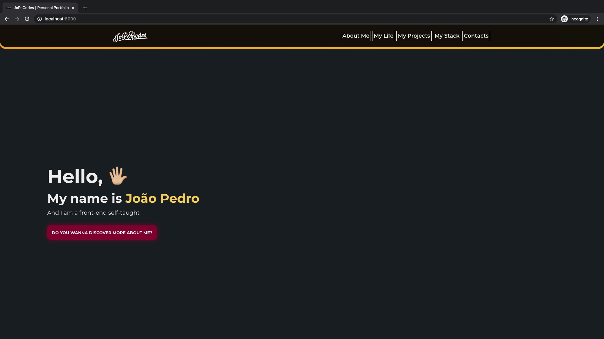

# My Typescript Portfolio

## [Check it here](https://www.jopecodes.com/)

My Portfolio page

## Getting Started

First project made with Typescript and I really enjoyed the experience! It is strongly typed and improves a lot the experience with the IDE, especially with VSCode

## Specifications

This was one of my wishes since I started my journey earlier this year. I wanted to have something mine where I could expose all of my projects to everyone, talking a bit about me and about all of my projects. For that I just used **Gatsby** based on **React** to create a static website that could be faster and with all of my own information. My last learning was **Typescript** so I thought that this project could be a good idea to implement it as well, so it is strongly typed with a lot of help from **IDE** based on the types that **Typescript** and I inferred.

With this way I could write **Markdowns** and everytime that I need to add a new project here, I just only need to write a new Markdown and **Gatsby** will do the magic behind the scenes and will bundle everything up into static files, ready to be re-deployed into the server.

## Built With

- React
- Gatsby
- SASS (modules)
- GRAPHQL
- Typescript

## Contributing

Feel free to download it and improve it. If you want just give a pull request with your changes and let me know what can be improved. Many thanks :D

## Pages

- [GitHub Page](https://github.com/BitInByte)
- [Instagram](https://www.instagram.com/bitinbyte/)
- [Twitter](https://twitter.com/BitInByte2)

## Authors

**BitInByte** - Development student and tech enthusiastic
